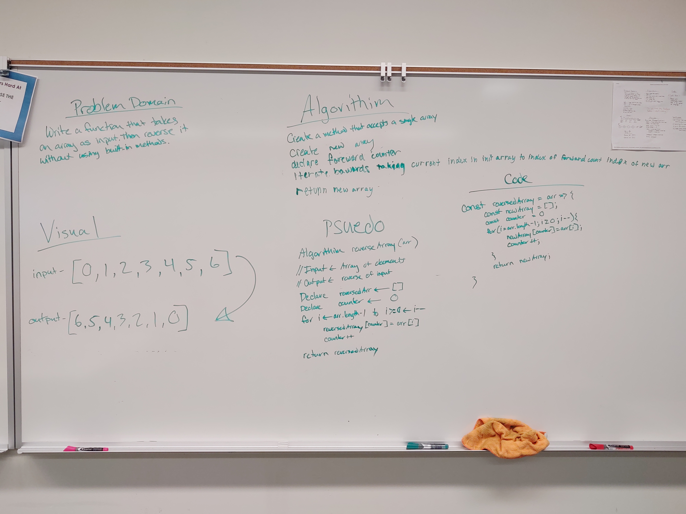

# Code Challege Array Reverse

# Reverse an Array

Code Challenges for 401. This is the first challenge.

## Challenge

Create a function to take an array, reverse the contents and return the reversed version without using any built-in array methods.

## Approach & Efficiency

We iterated through an array backwards and added the element at the current iterations index to a new array at an index determined by an incrementor outside the loop. 

It scales

## Solution

