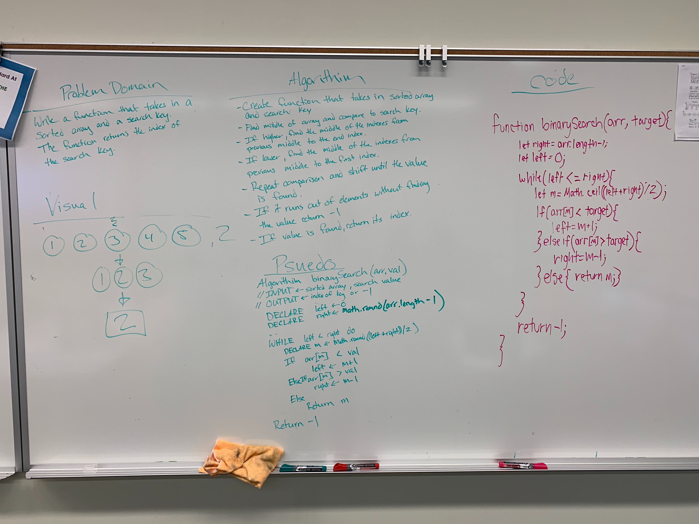

# Code Challege Binary Search

# Team

Myself and Travis Skyles

# Create a binary search function

Code Challenges for 401. This is the third challenge. A binary search is a function that finds the index of a given value withing a sorted array by cutting it's potential indexes in half each time a comparison is made.

## Challenge

Create a function that takes an array and a value. Use a binary search to locate the index of the value within the array. If the value is not within the array, return -1;

## Approach & Efficiency

Used a fairly traditional impletmentation of the binary search. 

## Solution

[Code](./binarySearch.js)
