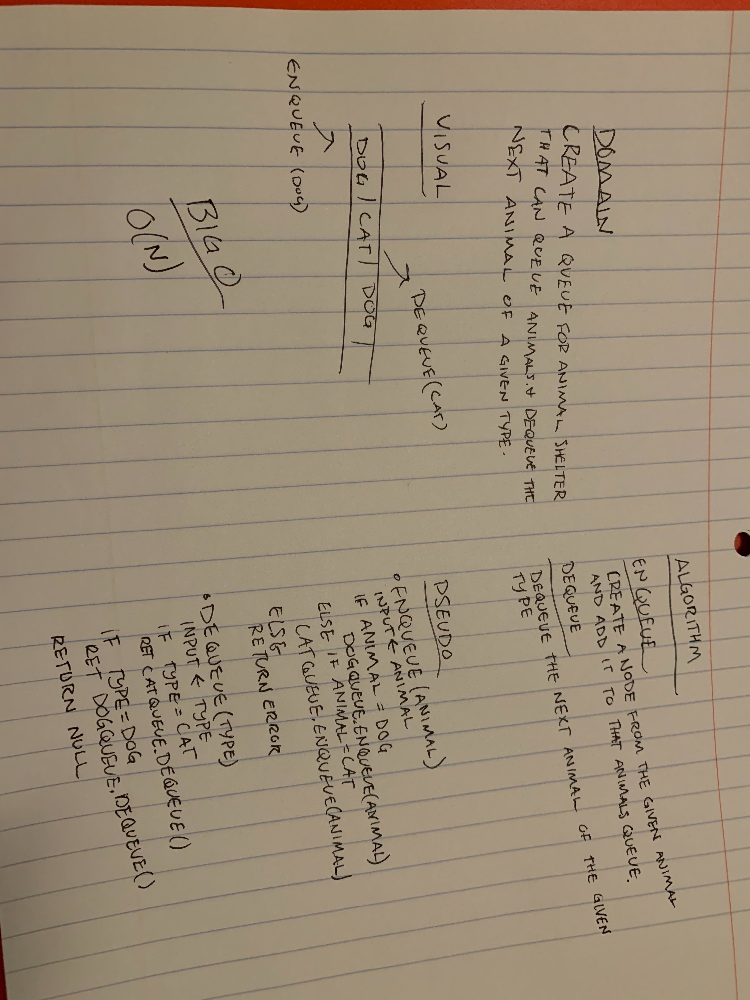

# Code Challege FIFO Animal Shelter

## Challenge

Create a class called AnimalShelter which holds only dogs and cats. The shelter operates using a first-in, first-out approach.

Implement: 
- enqueue(animal) : adds an animal to the shelter
- dequeue(pref) : returns either a dog or cat. If pref is not "dog" or "cat" then return null.

## Approach & Efficiency

Both functions I believe to operate at an O(n) in both time and space. 

## Solution

[Code](./FIFOAnimalShelter.js)
