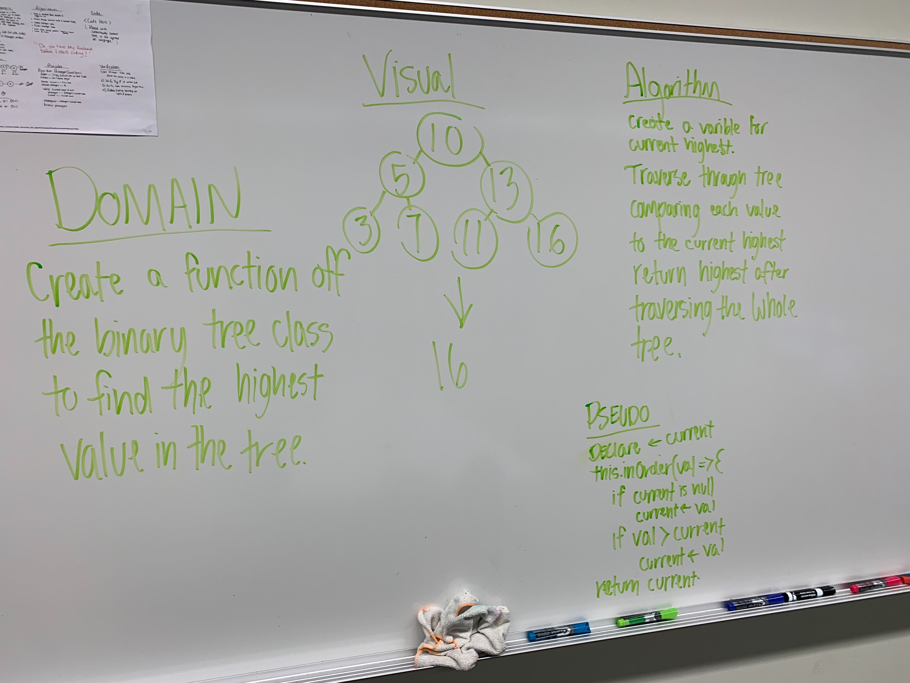

# Code Challege Max Value

## Challenge

Extend the binary tree class to include a method that finds the highest value in the tree

## Function

- MaxTree.maxValue() : Returns the highest value within the tree

## Approach & Efficiency

I believe I took what would be considered a pretty traditional approach to this problem.

I believe the effieciency of this will scale 1:1 with the amount of elements in the array passed. 

Each function scales at O(n) for both time and space.

## Solution

[Code](./maxvalue.js)

