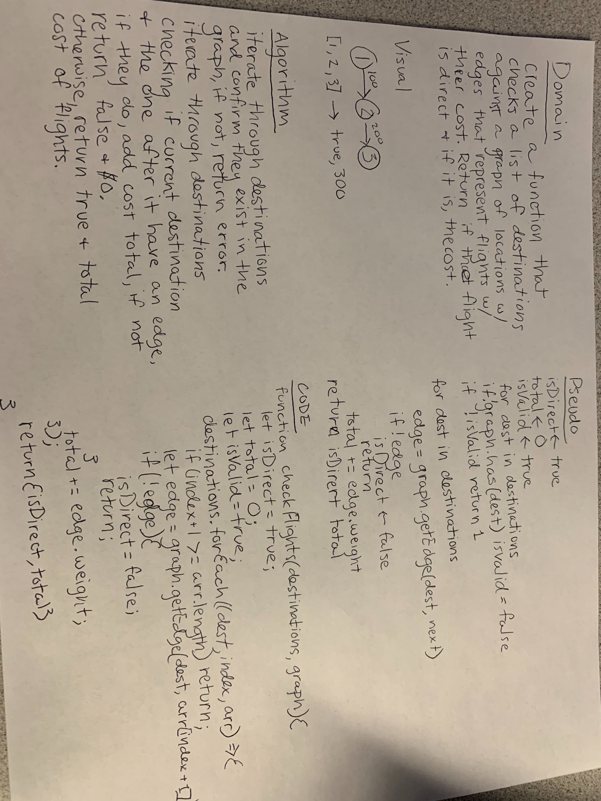

# Code Challege Get Edge (check flights...)

Create a function that cchecks a list of destinations against a graph of locations with edges that represent flights with their cost. Return if the flight is direct and it is, the cost.

## Approach & Efficiency

I believe I took what would be considered a pretty traditional approach to this problem.

The function will scale directly with the size of the data structure it is operated on.

Each function scales at O(n) for both time and space.

## Solution

