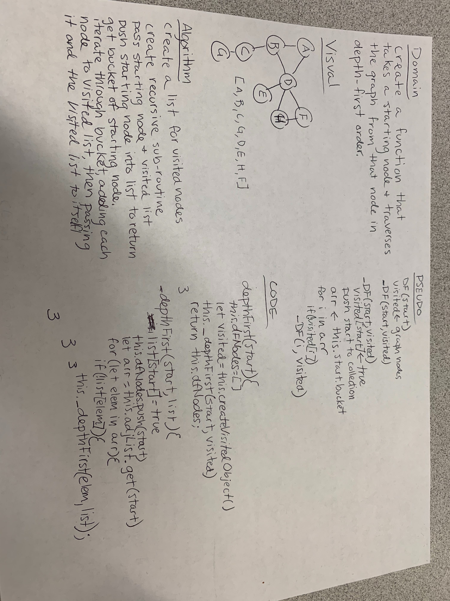

# Code Challege Breadth First Graph Traversal

Create a function that takes a starting node and traverses the graph, depth-first.

## Approach & Efficiency

I believe I took what would be considered a pretty traditional approach to this problem.

The function will scale directly with the size of the data structure it is operated on.

Each function scales at O(n) for both time and space.

## Solution

