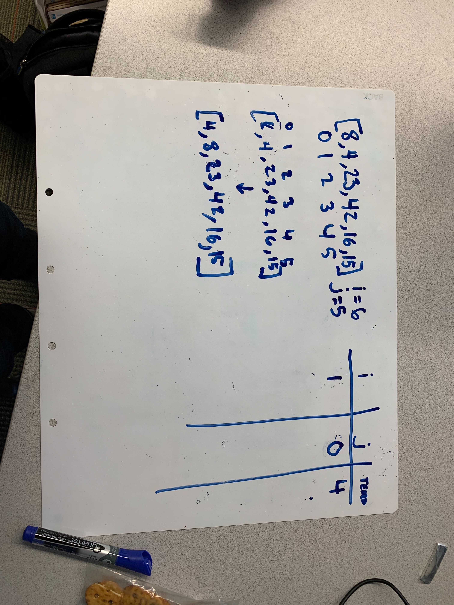
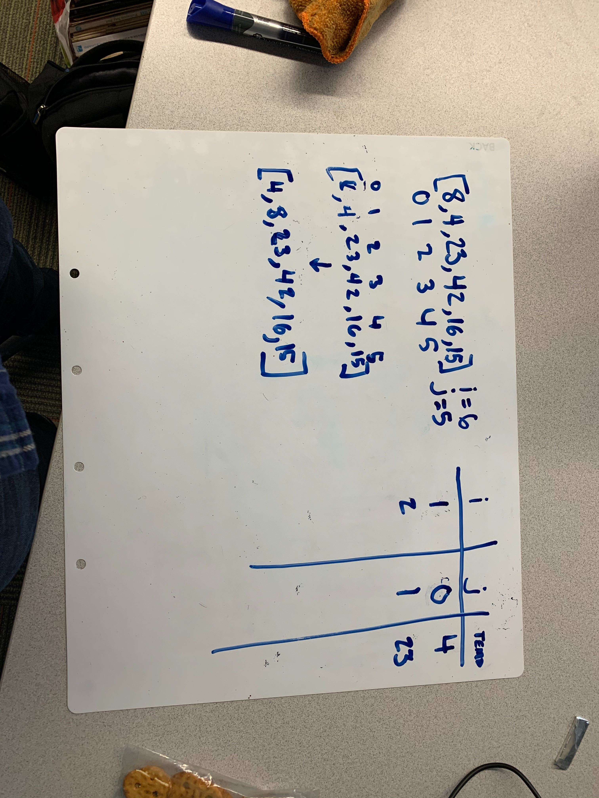
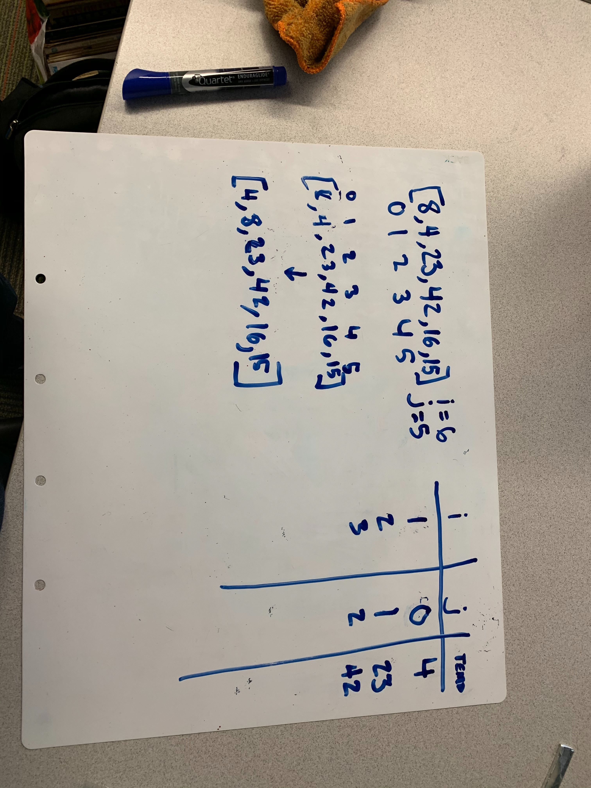
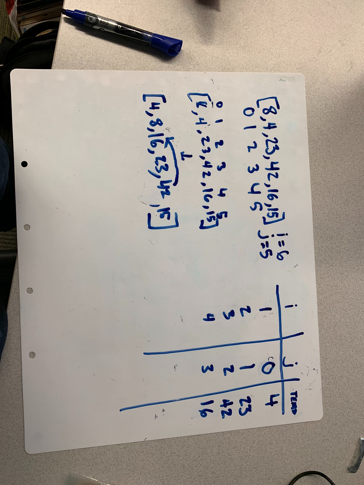
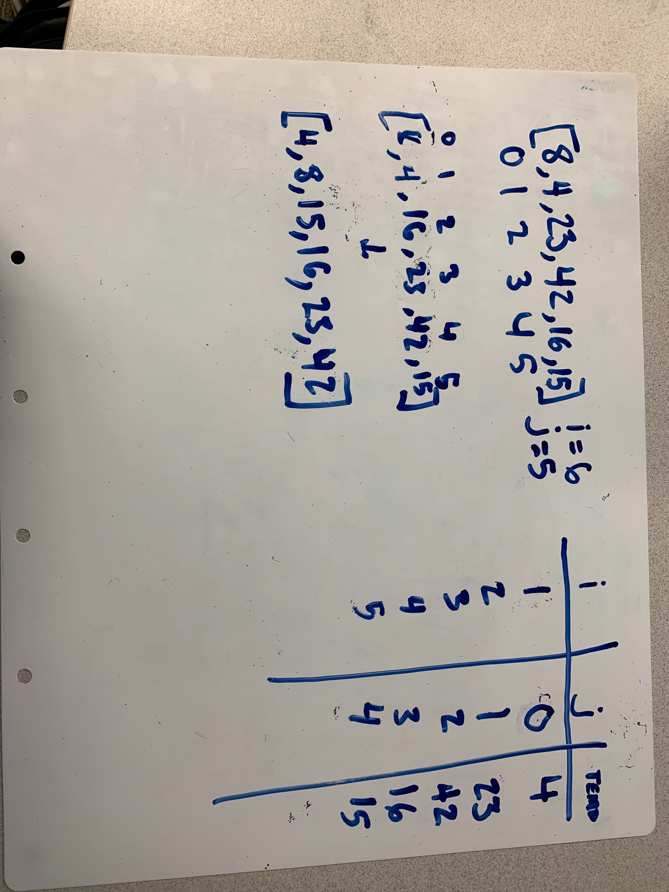

# Insertion Sort

Insertion sort is a sorting algorithm that works similar to the way we sort playing cards. Moving from the top of the array move each value up while the current value is lower than the one above it.

## Psuedocode

```
  InsertionSort(int[] arr)
  
    FOR i = 1 to arr.length
    
      int j <-- i - 1
      int temp <-- arr[i]
      
      WHILE j >= 0 AND temp < arr[j]
        arr[j + 1] <-- arr[j]
        j <-- j - 1
        
      arr[j + 1] <-- temp
```


## Trace

[8,4,23,42,16,15]








## Efficency 