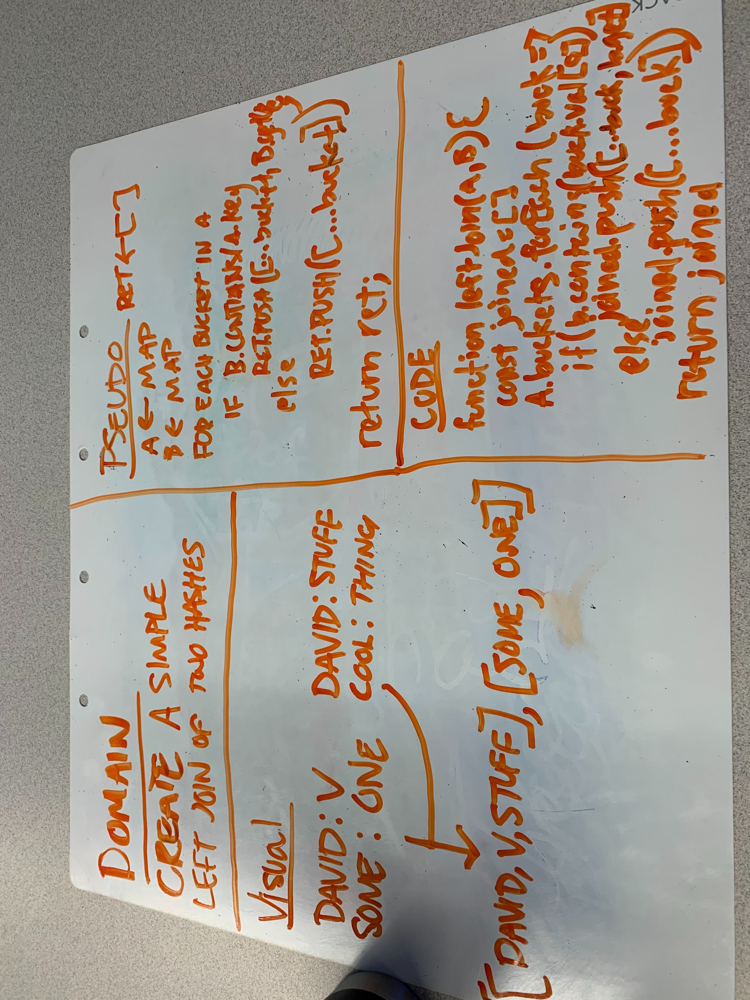

# Code Challege Left Join

## Join two hash maps by common keys

Given mapA and mapB, return an array with all the values in mapA appended with any values that have the same key from mapB

## Approach & Efficiency

I think this is O(n) because of the Hash Table being O(1).

Thus, the function scales at O(n) for both time and space.

## Solution

[Code](./left-join.js)

