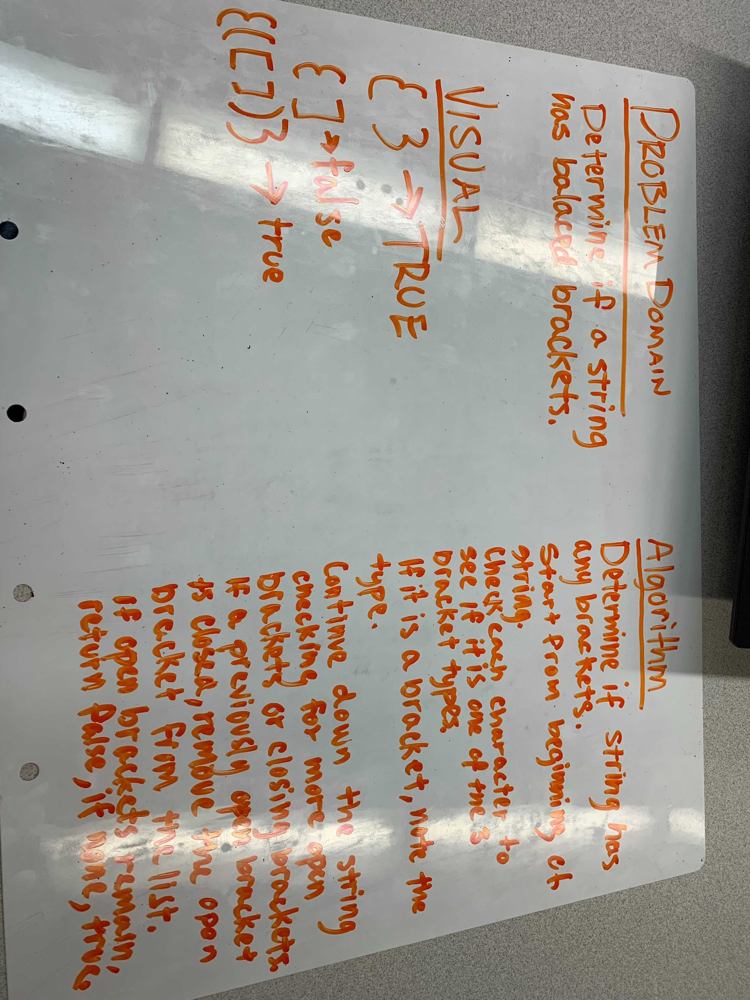

# Code Challege Multi-bracket Validator

## Challenge

Create a class that can validate that a string contains balanced (opened and closed brackets).

It can contain 3 types of brackets, {} [] ()

## Approach & Efficiency

O(n)

## Solution

[Code](./multibracket.js)
