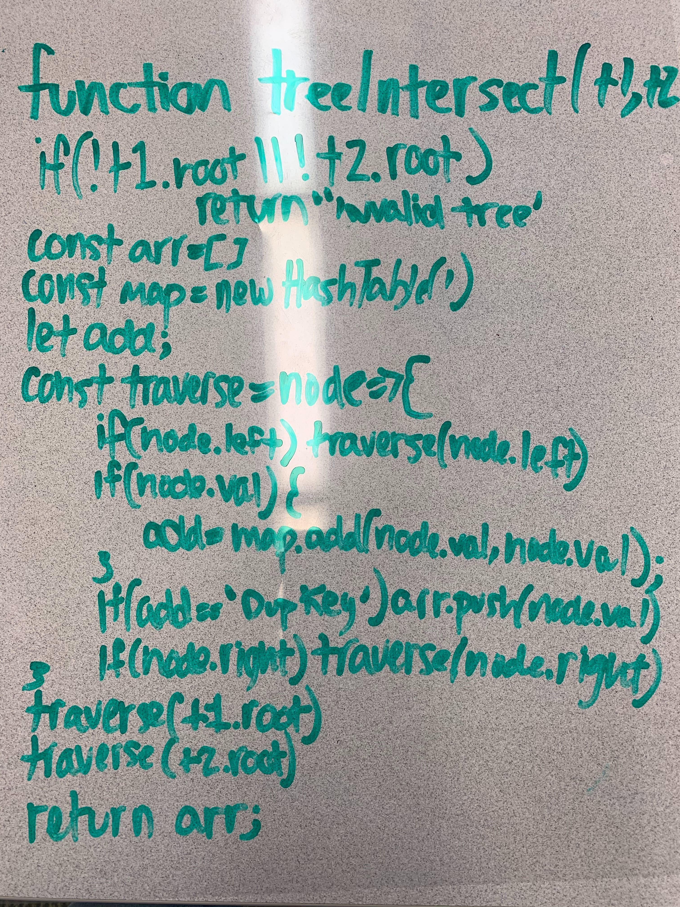
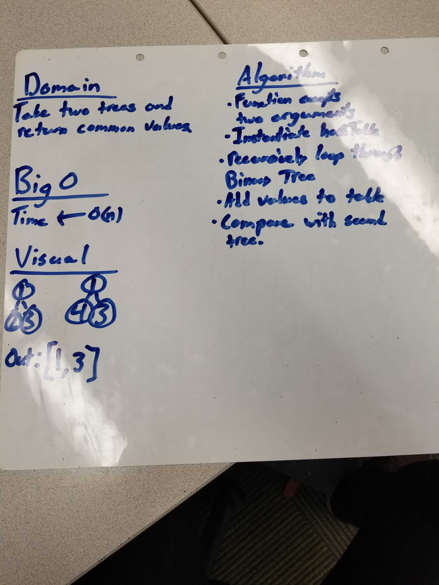
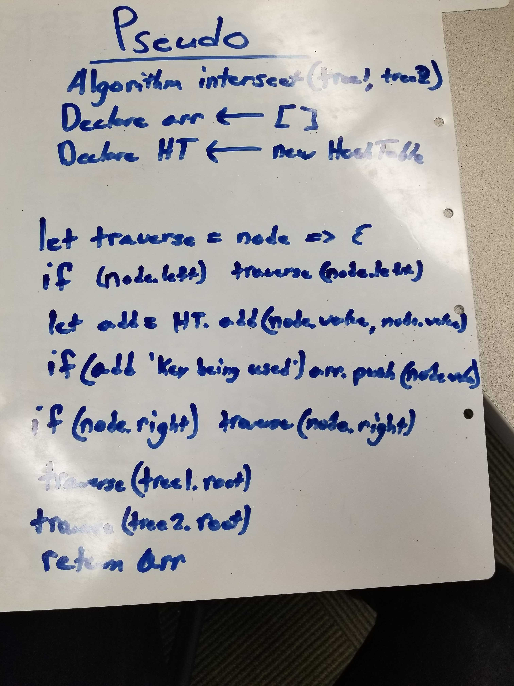

# Code Challege Tree Intersect

## Find common values between two binary trees

[Pull Request](https://github.com/david-vloedman-401-advanced-javascript/data-structures-and-algorithms/pull/29)

## Approach & Efficiency

I believe the function scales at O(n) for both time and space.

## Solution

