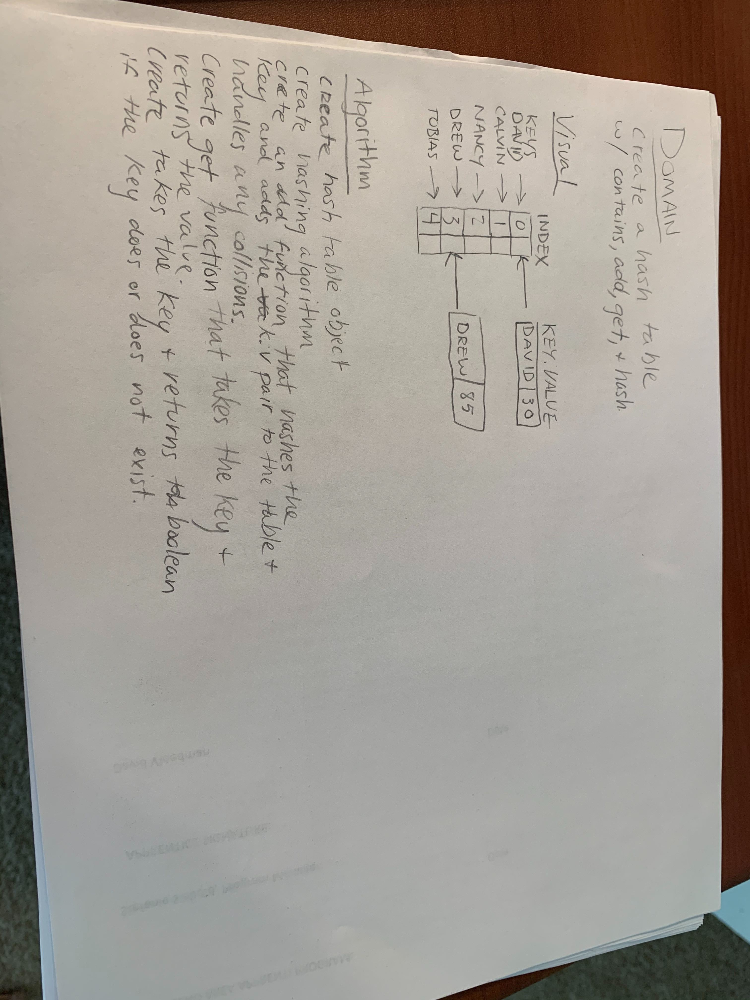
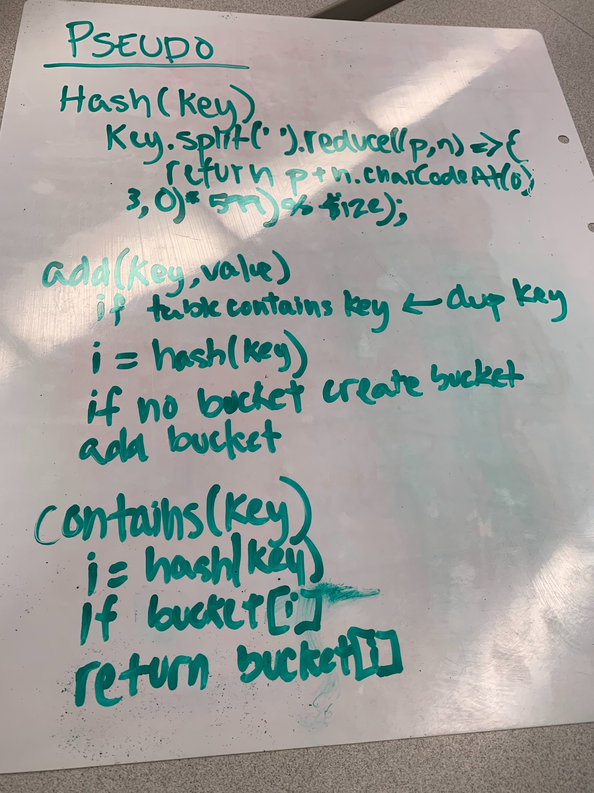
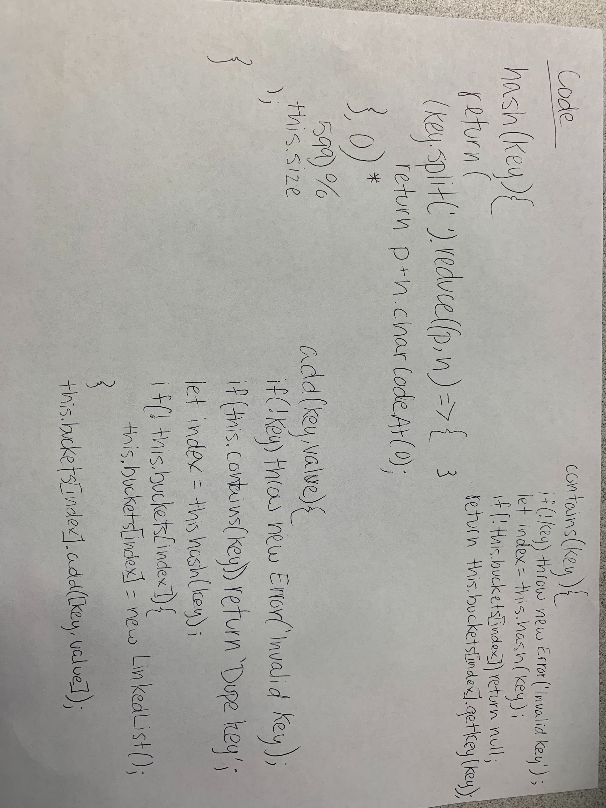

# Code Challege Hash Table

# Create a hash table

### Create linked list functionality 

[Pull Request](https://github.com/david-vloedman-401-advanced-javascript/data-structures-and-algorithms/pull/24)

### Hash Table

* Hash function attribution to Trevor Thompson

* `hash(key)` - Hashes key argument
* `add(key, value)` - Adds key and value to hash table
* `get(key)` - Retrieves key from hash table
* `contains(key)` - Returns boolean if hash table contains key

## Approach & Efficiency

Each function scales at O(1) for both time and space.

## Solution

[Code](./hash-table.js)

