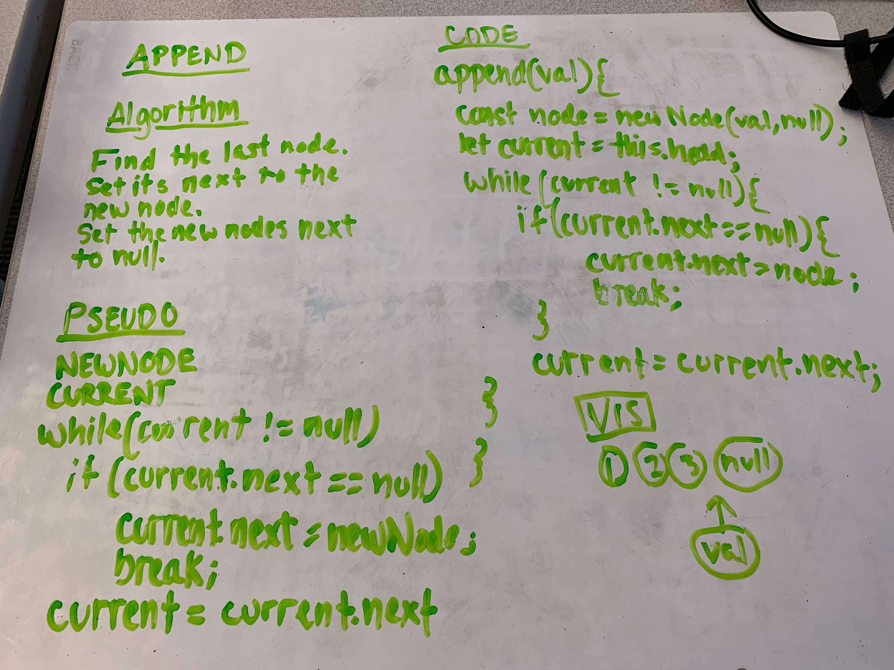
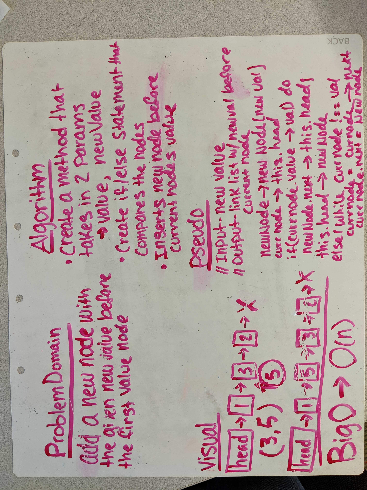
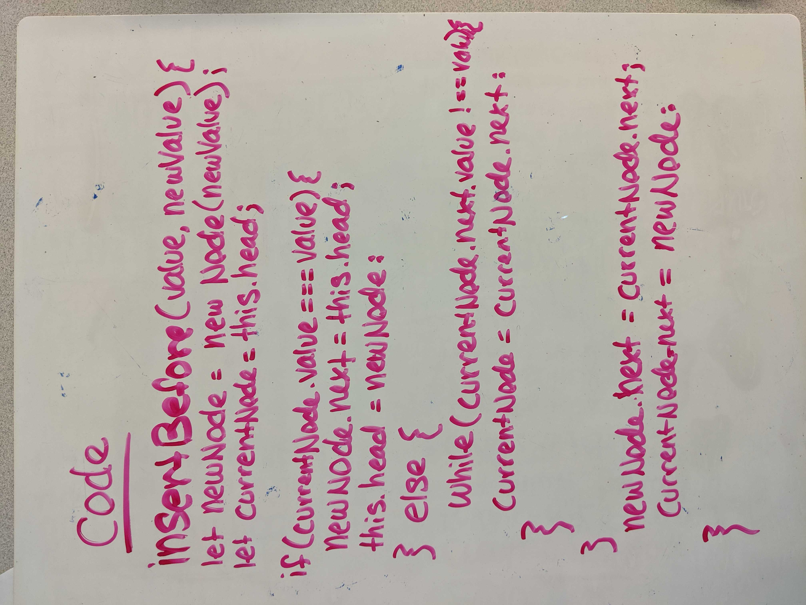
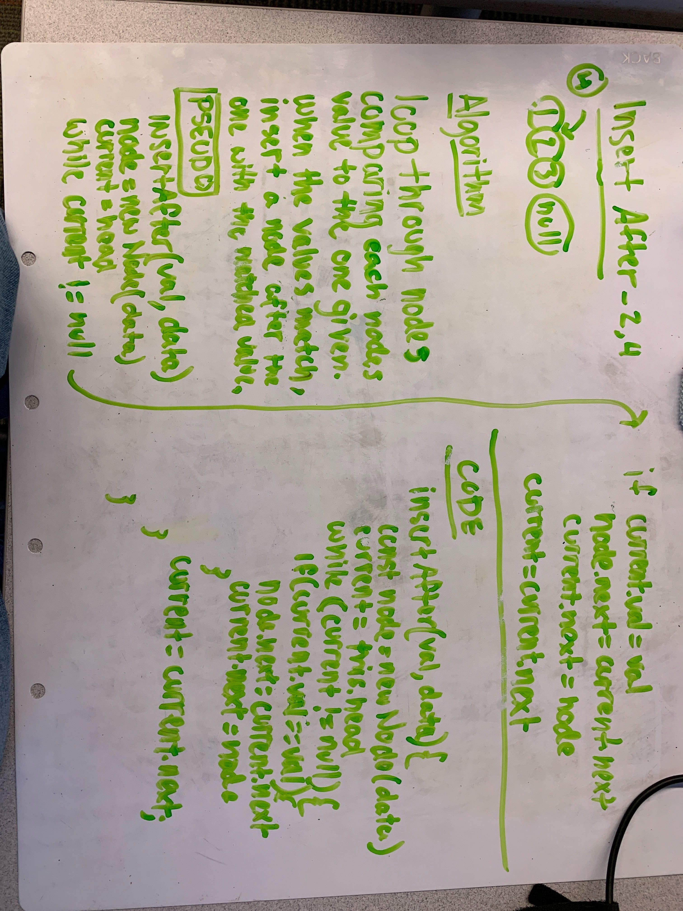
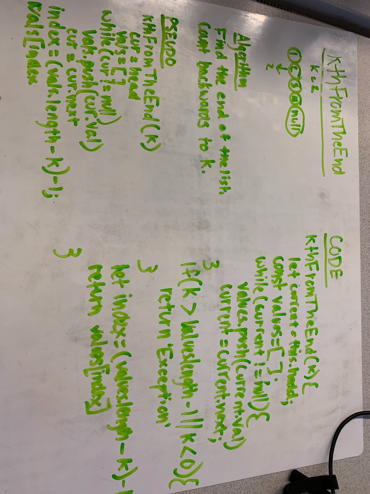

# Code Challege Linked List

# Create a simple linked list

Code Challenges for 401. This is the fourth challenge.

## Challenge & API

### Create linked list functionality 
- insert(val) : insert a value into the list
- includes(val) : is given value within the list?
- toString() : return all the values within the list as a human readable string
- append() : append a node to the end of the list
- insertBefore(val, newVal) : insert a node before a specifi node 
- insertAfter(val, newVal) : insert a node after a specific node
- kthFromEnd(k) : find the value of the node 'k' from the end of the list

## Approach & Efficiency

I took a pretty standard approach and utilized a lot of the same concepts from the class demo.

I believe the effieciency of this will scale 1:1 with the amount of elements in the array passed. 

Each function scales at O(n) for both time and space.

## Solution

[Code](./linkedList.js)

### Append 

Domain - Append a node to the end of the linked list

### Insert Before

Domain - Insert a node before the node with the given value

### Insert After 

Domain - Insert a node after the node with a given value 

### Kth from the end

Domain - Get the value of the node 'k'th from the end of the list

