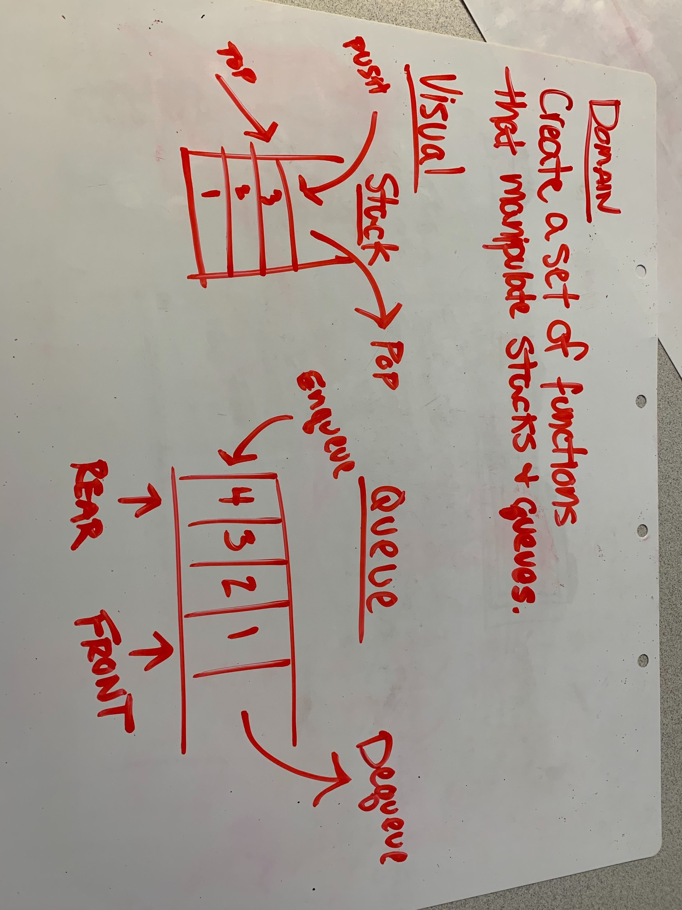
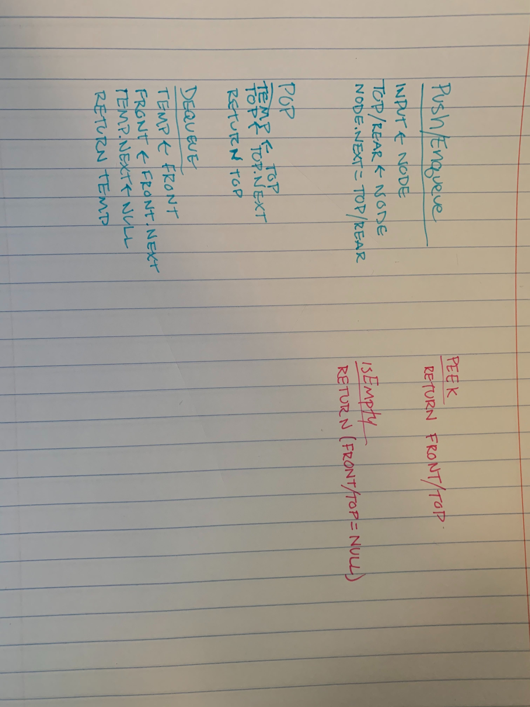

# Code Challege Queue

# Create a simple queue

## Queue

### Create queue functionality 
- enqueue(node) : puts a node into the queue
- dequeue() : removes the node at the front of the queue and returns it
- peek() : returns the node at the front of the queue, but leaves its position in the queue
- isEmpty() : returns a boolean stating whether or not the queue is empty

## Approach & Efficiency

I took a pretty tradition approach working from the reading assignment, 'Stacks & Queues'. 

I believe the effieciency of this will scale 1:1 with the amount of elements in the array passed. 

Each function scales at O(n) for both time and space.

## Solution

[Code](./queue.js)

## Queues, enqueue, dequeue, peek, and isEmpty

[code](./stack.js)